# Pipeline

## Ortamın Hazırlanması

### Versiyon bilgilerinin tutulması

1. Pipeline sekmesi içerisinden Library dizinine geliyoruz.
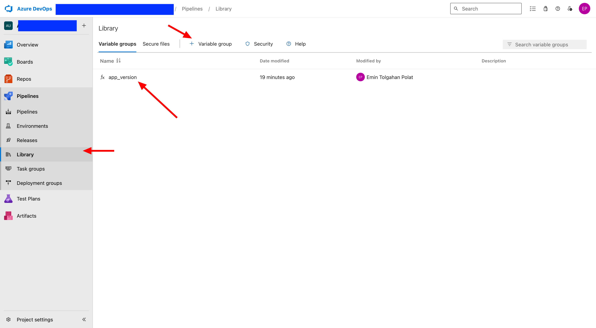 
1. Variable group ekliyoruz. "app_version"
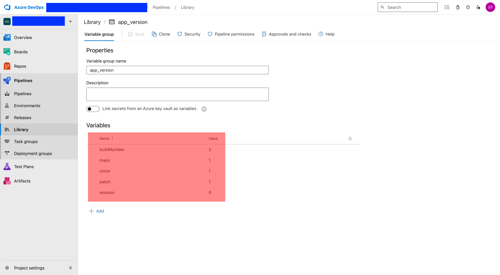
1. Sürüm bilgilerini giriyoruz.

* **Major: (major)** 
Bu tür bir sürüm değişikliği genellikle büyük ve önemli yenilikleri temsil eder. Kullanıcılar için "zorunlu güncelleme" gerektirebilir, yani eski sürüm artık desteklenmeyebilir. Büyük özellik eklemeleri veya radikal değişiklikler bu kategori altında yer alır. 

* **Minor: (minor)** 
 Minor sürüm güncellemeleri, önemli ancak daha küçük özellik eklemelerini içerir. Kullanıcı deneyimini geliştiren yenilikler ve bazı hata düzeltmeleri bu kategoriye girer. Kullanıcılar genellikle "zorunlu güncelleme" yapmak zorunda değillerdir, ancak önerilir. 

* **Patch: (parch)**
Bu tür sürüm güncellemeleri, genellikle hata düzeltmelerini ve güvenlik iyileştirmelerini içerir. Kritik hataları gidermek veya potansiyel güvenlik açıklarını kapatmak için yayınlanabilir. Kullanıcıların genellikle bu tür güncellemeleri yapmaları önerilir, ancak "zorunlu güncelleme" gerektirmez. 

* **Revision: (revision)**
Bu sürüm, genellikle geliştirme aşamasındaki yazılımlar için kullanılır. İleri düzeyde teknik kullanıcılar veya geliştiriciler tarafından kullanılabilir. Genel kullanıcılar için yaygın olarak dağıtılan bir sürüm değildir. 

* **Build Number: (buildNumber)**
Her sürümün benzersiz bir tanımlayıcısı olan derleme numarası, genellikle içsel kullanım veya yazılımın geliştirilme aşamalarını takip etmek için kullanılır. Kullanıcılar genellikle derleme numarasıyla ilgilenmezler, çünkü sürüm numarası (Major, Minor, Patch) daha anlamlıdır. 

### Android JKS Dosyasının eklenmesi
* [Key dosyası nedir nasıl oluşturulur](assets/https://developer.android.com/studio/publish/app-signing)
1. key.properties dosyası oluşturun

    ``` 
    storePassword = store_password_string
    keyPassword = key_password_string
    keyAlias = key_string
    ```
1. Android app gradle dosyasını düzenleyin
    ```
    def keystoreProperties = new Properties()
    def keystorePropertiesFile = rootProject.file('key.properties')
    if (keystorePropertiesFile.exists()) {
        keystoreProperties.load(new FileInputStream(keystorePropertiesFile))
    }

    android {
      signingConfigs {
            release {
                storeFile file('key.keystore')
                keyAlias keystoreProperties['keyAlias']
                keyPassword keystoreProperties['keyPassword']
                storePassword keystoreProperties['storePassword']
            }
        }
    }
    ```
1. Dosyaları doğru dizine taşıyın ya da azure secure file yardımıyla taşıyın.
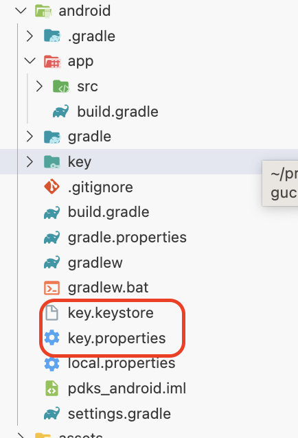
1. Mevcut key.keystore dosyasını ve key.properties dosyasını azure secure file dizinine ekleyin.
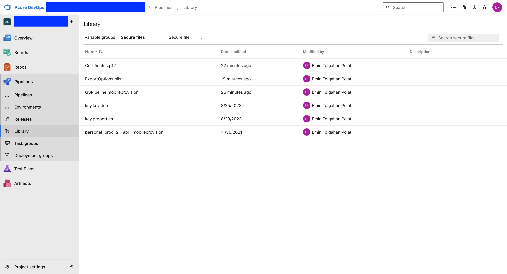

### Apple Sertifika Eklenmesi
1. Localde önce tüm sertifikaları silip sonra adımları yapmanız daha sağlıklı olacaktır.
1. XCode > Target > signin içerisinden manuel olarak ayarlanmalıdır. Aşağıda oluşturulan Mobilprovision sertifikası seçilmelidir. Uyarı versiyorsa devam edilmelidir.
1. Mobil Provision ve ExportOptions.plist'i eğer bundle id değişiyorsa tüm bundle idler için özel üretmek gerekiyor.
#### Apple Mobilprovision sertifikası oluşturma
1. developer.apple.com adresine giriniz ve aşağıdaki adımları yapın.
1. Cihazlara yaymak için adhoc appstore için appstore seçilmei
1. Program resources altında profiles e tıklayın 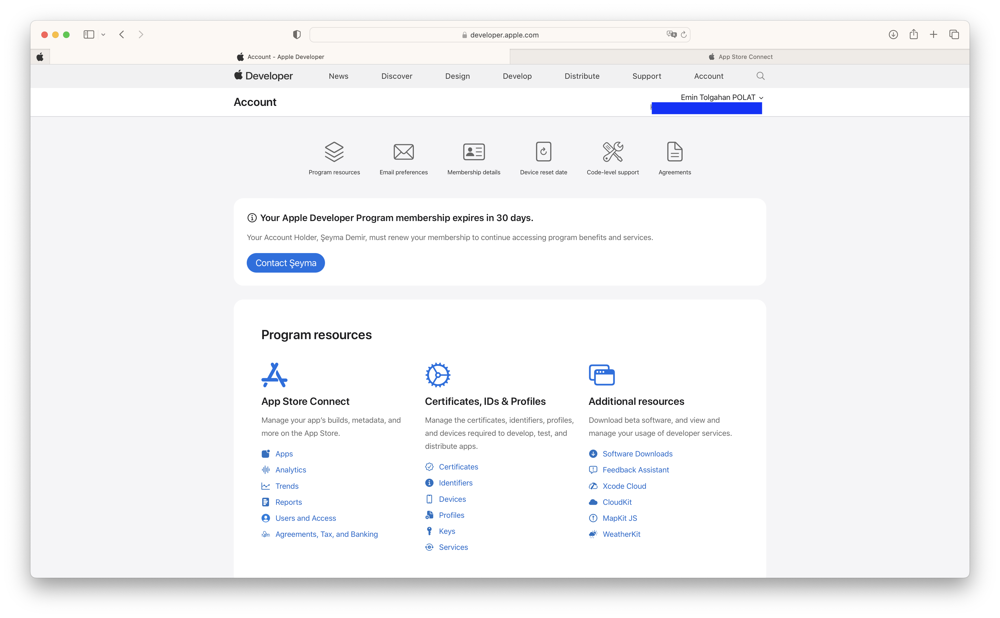
1. + işaretine tıklayın 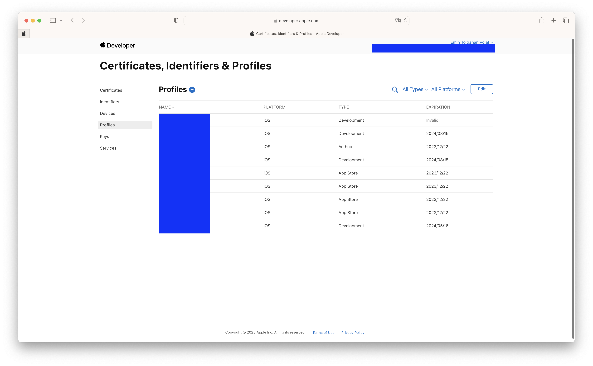
1. iOS App Developlemnt seçeneğini seçin 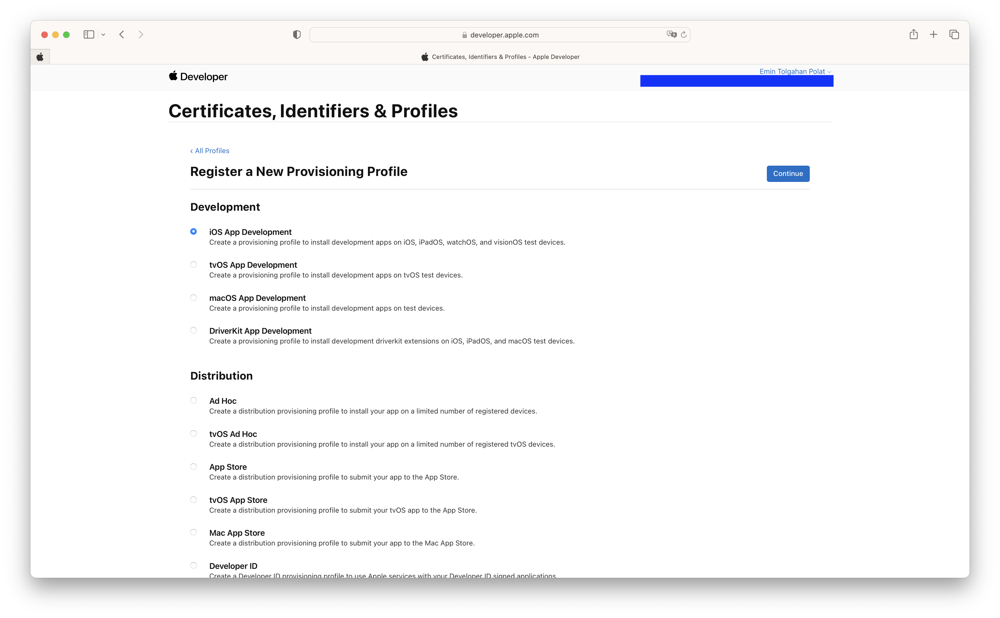
1. AppId seçin 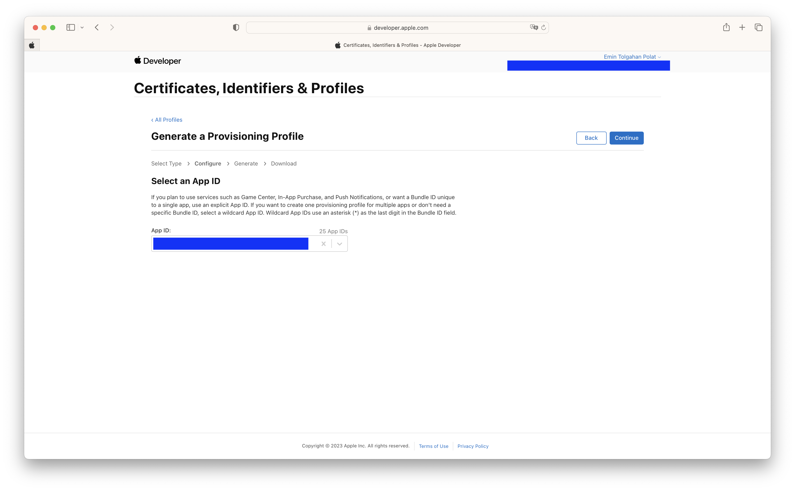
1. Cihazları seçin 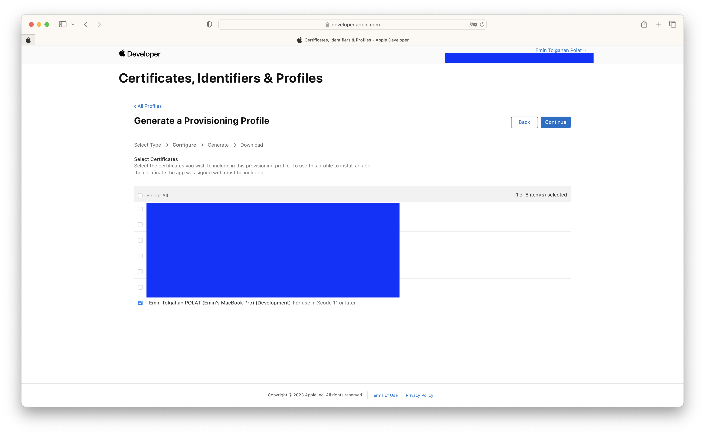
1. Mobil provision dosyasını indirin. 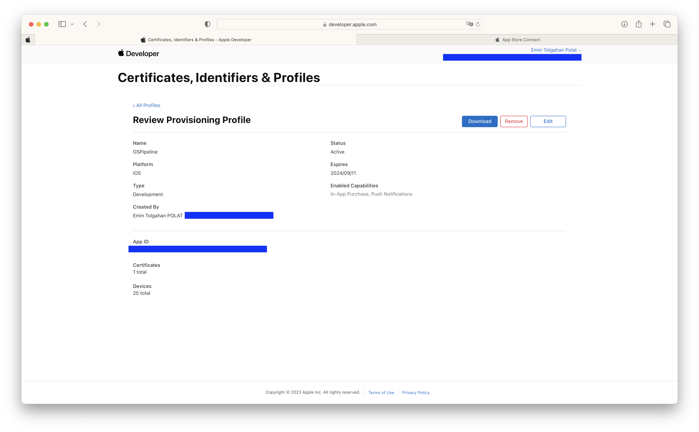


#### Apple p12 sertifikası oluşturma
1. developer.apple.com adresinden Apple Development ve Apple Distribution .cer uzantılı sertifikaları üretip indirin ve çift tıklayarak keychaine ekleyin.
1. Command + Space e basıp Keychain Access uygulamasını açın
1. Certificate sekmesine gelin Apple Development ve Apple Distribution a sağ tıklayıp export seçeneğini seçin. Biri geliştirme ortamı için biri dağıtım için kullanılacaktır 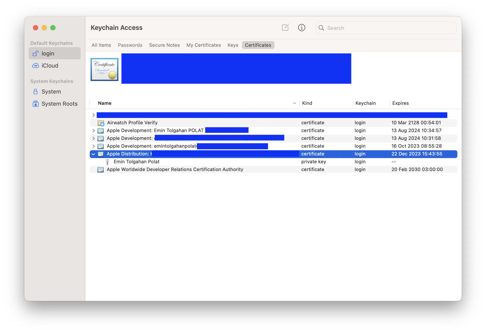
1. Dosya yolunu seçin 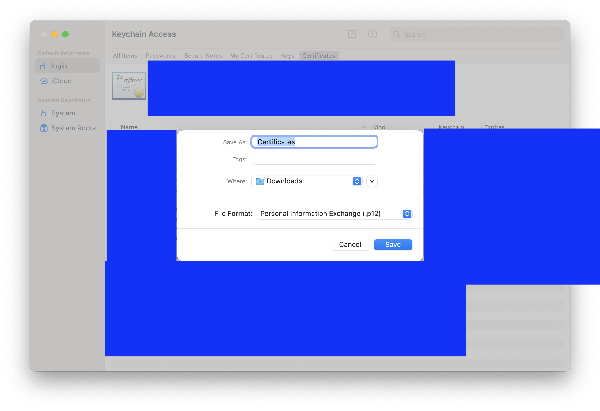
1. Parola girin ve bu paralı unutmayın. 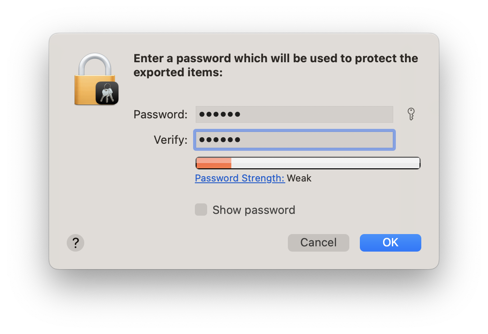

#### ExportOptions.plist dosyasını oluşturma

1. ExportOptions.plist dosyasını oluşturmak için xcode dan archive alıp Distribute App yapılmalı. 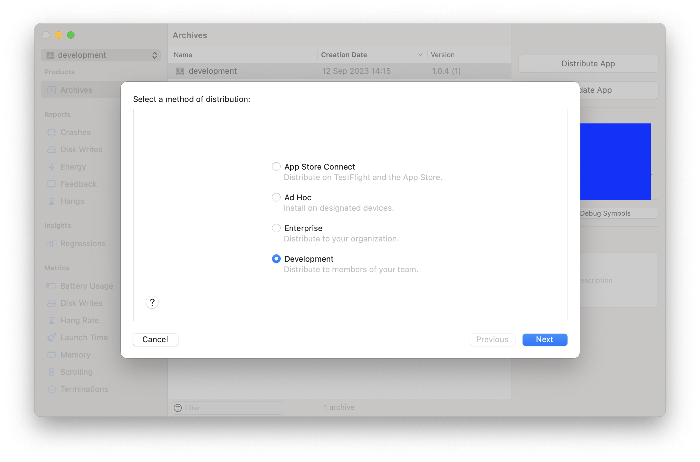
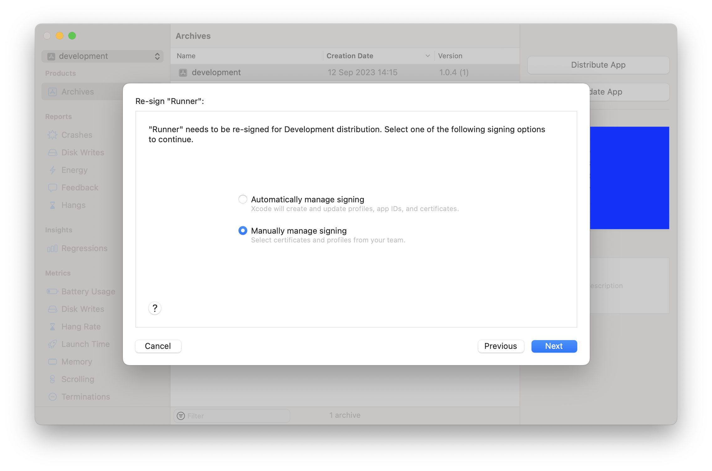
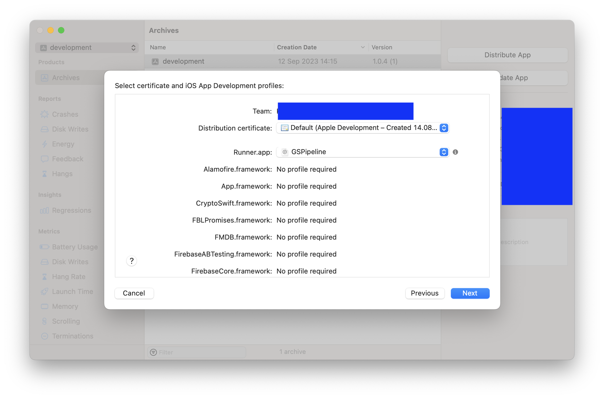
1. Export edilen dosyanın içerisinden ExportOptions.plist dosyasını alabilirsiniz.
### Google Play Bağlantısının Yapılması
1.Google Play Consolda Ana hesapla oturum açıp Api Erişimi sekmesine gelin
1. Kullan ıcı ve izinlerden api kullanıcısna uygulama eklenmeli
1.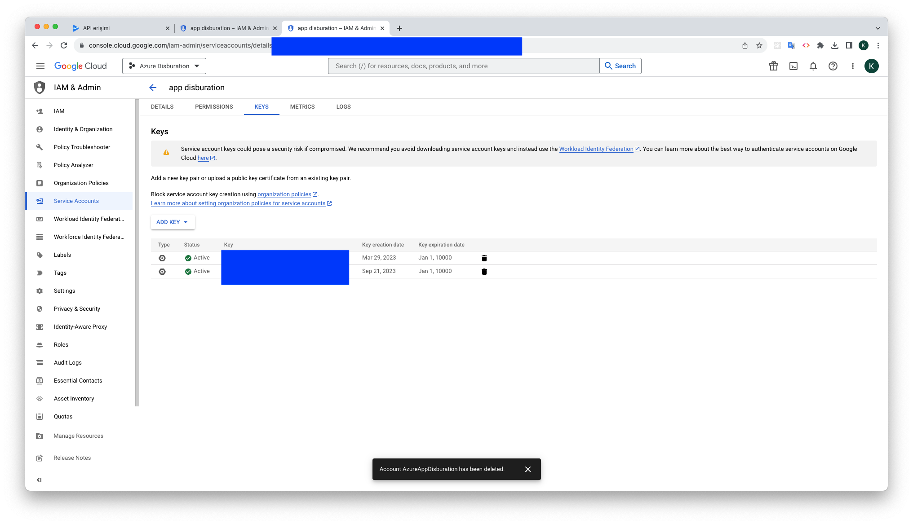
### Appstore Bağlantısının Yapılması
1. developer.apple.com da ana hesapla oturum açıp User and Access > Key kısımına gelip app Store Connect Apı oluşturun
1.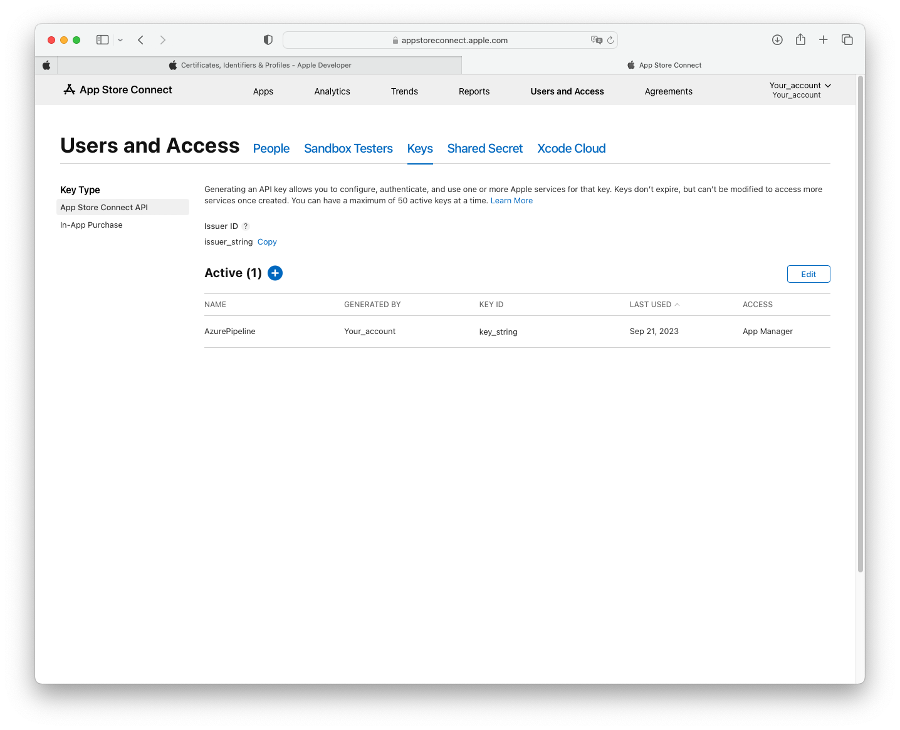
1. Daha sonra buradaki bilgileri  Azure Project Settings > Service connections kısmında ekleyin
1. p8 dosyası indrilecek tek seferlik indiriliyor bu dosyanın tamamını base64 e çevirmek gerekiyor.

```
// terminal
base64 -i apikey.p8 -o apikey.txt
```

### Huawei App Galery Bağlantısının Yapılması
1. My Apps > User and Permissions > API Key ile connect API Key oluituruyoruz.
1. My Apps içerisinden AppID değişkenini alıyoruz client_id ve  client_secret değerlerini alıyoruz

Just use html


1. ACCESS_TOKEN  aldeğişkeni alınıyor
    ``` sh
    curl --location 'https://connect-api.cloud.huawei.com/api/oauth2/v1/token' \
    --header 'Content-Type: application/json' \
    --data '{
        "client_id": "CLIENT_ID",
        "client_secret": "CLIENT_SECRET",
        "grant_type": "client_credentials"
    }'
    ```
1. uploadUrl ve authCode alınıyor. APP_ID değeri veriliyor
    ```sh
    curl --location 'https://connect-api.cloud.huawei.com/api/publish/v2/upload-url?appId=APP_ID&suffix=aab' \
    --header 'client_id: CLIENT_ID' \
    --header 'Authorization: Bearer ACCESS_TOKEN'
    ```

1.  fileDestUrl ve  size değerini veriyor
    ```sh
      curl --location 'uploadUrl' \
    --header 'Accept: application/json' \
    --form 'file=@"/filepath/app-production-release.aab"' \
    --form 'authCode="AUTH_CODE"' \
    --form 'fileCount="1"'
    ```
1. son adımda bu servise istek atıyoruz.
    ```sh
    curl --location --request PUT 'https://connect-api.cloud.huawei.com/api/publish/v2/app-file-info?appId=APP_ID' \
    --header 'client_id: CLIENT_ID' \
    --header 'Content-Type: application/json' \
    --header 'Authorization: Bearer ACCESS_TOKEN' \
    --data '{
        "appId": "APP_ID",
        "fileType": 5,
        "files": [
            {
                "fileDestUrl": "fileDestUrl_string",
                "fileName": "app-production-release.aab",
                "size": size_int
            }
        ]
    }'
    ```


```sh 
   # İlk curl komutu ile OAuth2 tokenini alın
curl_response=$(curl --location 'https://connect-api.cloud.huawei.com/api/oauth2/v1/token' \
  --header 'Content-Type: application/json' \
  --data '{
      "client_id": "$(huawei_client_id)",
      "client_secret": "$(huawei_client_secret)",
      "grant_type": "client_credentials"
  }')

access_token=$(echo "$curl_response" | jq -r '.access_token')

# İkinci curl komutunu çalıştırın ve önceki adımda alınan access_token ile gönderin
upload_url_response=$(curl --location 'https://connect-api.cloud.huawei.com/api/publish/v2upload-url?appId=APPID&suffix=aab' \
  --header 'client_id: $(huawei_client_id)' \
  --header "Authorization: Bearer $access_token")

# İkinci curl komutunun yanıtını ayrıştırın ve authCode ile uploadURL'yi alın
authCode=$(echo "$upload_url_response" | jq -r '.authCode')
uploadURL=$(echo "$upload_url_response" | jq -r '.uploadURL')

# Üçüncü curl komutunu çalıştırın ve önceki adımlardan alınan authCode ve uploadURL ile gönderin
final_response=$(curl --location "$uploadURL" \
  --header 'Accept: application/json' \
  --form 'file=@"**/app-production-release.aab"' \
  --form "authCode=$authCode" \
  --form "fileCount=1")

# Üçüncü curl komutunun yanıtını ayrıştırın ve fileDestUrl ile size değerlerini alın
fileDestUrl=$(echo "$final_response" | jq -r '.fileDestUrl')
size=$(echo "$final_response" | jq -r '.size')

# Dördüncü curl komutunu çalıştırın ve önceki adımlardan alınan fileDestUrl ve size ile gönderin
put_response=$(curl --location --request PUT "https://connect-api.cloud.huawei.com/api/publish/v2app-file-info?appId=APPID" \
  --header 'client_id: $(huawei_client_id)' \
  --header 'Content-Type: application/json' \
  --header "Authorization: Bearer $access_token" \
  --data '{
      "appId": "APPID",
      "fileType": 5,
      "files": [
          {
              "fileDestUrl": "'"$fileDestUrl"'",
              "fileName": "app-production-release.aab",
              "size": '"$size"'
          }
      ]
  }')

# Dördüncü curl komutunun yanıtını ekrana yazdırın
echo "PUT Response: $put_response"
```

### Appcenter Bağlantısının Yapılması
1. Appcenter da proje ayarlarından "App API tokens" oluşturun 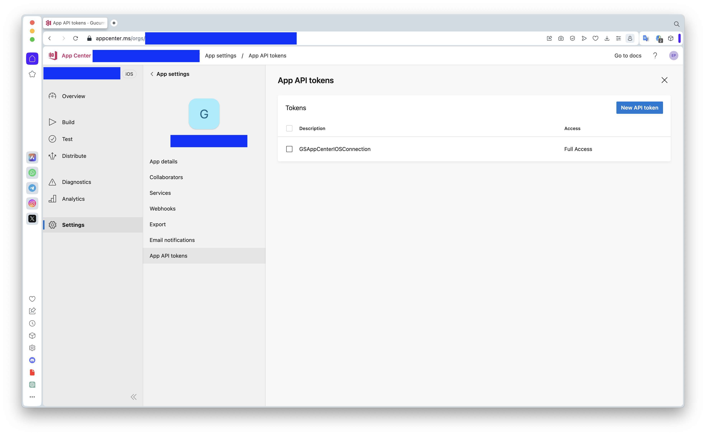
1. Azure Project Settings > Service connections alanına gelin  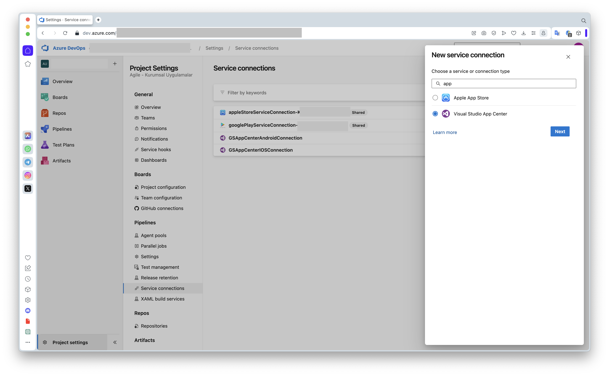
1. İlk adımda aldığımız tokenı buraya ekliyoruz 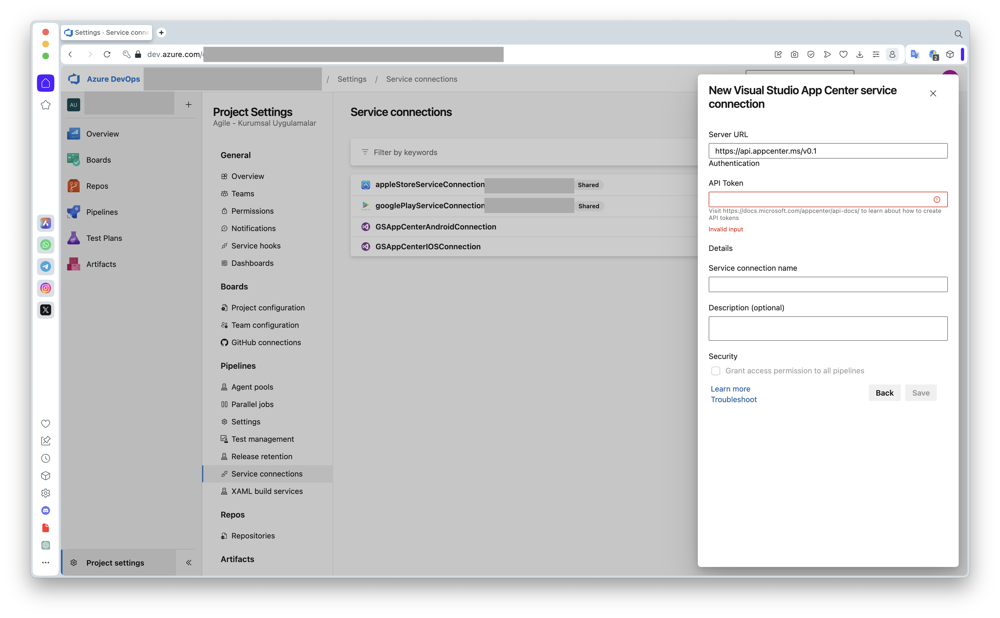
### Pipeline Kodunu Yazılması

``` yaml
# dev ortamı için otomatik tetiklenmeyi sağlar
trigger:
  - dev
# Uygulama versiyonu bilgilerini azure library üzerinden alır
variables:
- group: app_version
- name : appMajor
  value: $[variables.major]
- name : appMinor
  value: $[variables.minor]
- name : appPatch
  value: $[variables.patch]
- name : appRevision
  value: $[variables.revision]
- name : appBuildNumber
  value: $[variables.buildNumber]
- name : localBuildName
  value: $(appMajor).$(appMinor).$[$(appPatch)+1].$[$(appRevision)+1]
- name : localBuildNumber
  value: $(appBuildNumber)

stages:
  - stage: FlutterBuild
    displayName: Flutter Build
    jobs:
      - job: AndroiJob
        displayName: Android
        pool:
          vmImage: 'macOS-latest' 
        steps:
        # Android derlenmesi için java kurulumu yapılır.
        - task: JavaToolInstaller@0
          displayName: 'Java kur.'
          inputs:
            versionSpec: '11'
            jdkArchitectureOption: 'x64'
            jdkSourceOption: 'PreInstalled'
        # flutter derlenmesi için flutter kurulumu yapılır
        - task: FlutterInstall@0
          displayName: 'Flutter kur.'
          inputs:
            channel: 'stable'
            version: 'latest'
        # Uygulama paketleri kurulur
        - task: Bash@3
          displayName: 'Flutter paketleri kur.'
          inputs:
            targetType: 'inline'
            script: '$(FlutterToolPath)/flutter clean && $(FlutterToolPath)/flutter pub get'
            workingDirectory: '$(System.DefaultWorkingDirectory)'
        # Dil desteği varsa kodu oluşturur
        - task: Bash@3
          displayName: 'Flutter dil dosyası yarat.'
          inputs:
            targetType: 'inline'
            script: '$(FlutterToolPath)/flutter gen-l10n'
            workingDirectory: '$(System.DefaultWorkingDirectory)'
        # Flutter build runner kodlarını oluşturur
        - task: Bash@3
          displayName: 'Flutter kodları yarat.'
          inputs:
            targetType: 'inline'
            script: '$(FlutterToolPath)/flutter pub run build_runner build --delete-conflicting-outputs'
            workingDirectory: '$(System.DefaultWorkingDirectory)'
        # App bundle imzalamak için azure secure fileden properties dosyası çekilir
        - task: DownloadSecureFile@1
          displayName: 'KeyProperties getir'
          name: keyProperties
          inputs:
            secureFile: 'key.properties'
        - script: |
            echo Installing $(keyProperties.secureFilePath) to the trusted CA directory...
            sudo chown root:root $(keyProperties.secureFilePath)
            sudo chmod a+r $(keyProperties.secureFilePath)
            cd android/
            touch key.properties
            sudo mv $(keyProperties.secureFilePath) /Users/runner/work/1/s/android/key.properties
          displayName: 'KeyProperties getir'
        # App bundle imzalamak için azure secure fileden keystore dosyası çekilir
        - task: DownloadSecureFile@1
          name: keyStore
          inputs:
            secureFile: 'key.keystore'
        - script: |
            echo Installing $(keyStore.secureFilePath) to the trusted CA directory...
            sudo chown root:root $(keyStore.secureFilePath)
            sudo chmod a+r $(keyStore.secureFilePath)
            cd android/app/
            touch key.keystore
            sudo mv $(keyStore.secureFilePath) /Users/runner/work/1/s/android/app/key.keystore
          displayName: 'KeyStore getir'
        # App Bundle ya da apk oluşturur
        - task: Bash@3
          displayName: 'AppBundle oluştur.'
          inputs:
            targetType: 'inline'
            script: $(FlutterToolPath)/flutter build appbundle --obfuscate --split-debug-info=./gs/build/outputs  --release  --flavor development --target lib/main_development.dart --build-number  $[$(localBuildNumber)+$(appRevision)+1] --build-name  $(localBuildName)
            workingDirectory: '$(System.DefaultWorkingDirectory)'
        # Dizine kopyalar
        - task: CopyFiles@2
          displayName: 'AppBundle dizine kopyala.'
          inputs:
            contents: '**/*.aab'
            targetFolder: '$(build.artifactStagingDirectory)'
        # App Storeda paylaşır
        - task: AppCenterDistribute@3
          inputs:
            serverEndpoint: 'GSAppCenterAndroidConnection'
            appSlug: '{AZURE_PROJE}/{REPO_NAME}'
            appFile: '**/app-development-release.aab'
            symbolsOption: 'Android'
            releaseNotesOption: 'input'
            releaseNotesInput: '$(Build.SourceVersionMessage)'
            destinationType: 'groups'
        # iOS cocoapods kurulumlarını yapar
        - task: CocoaPods@0
          inputs:
            forceRepoUpdate: true
            projectDirectory: 'ios'
        # p12 sertifikasını secure fileden alır
        - task: InstallAppleCertificate@2
          inputs:
            certSecureFile: 'Certificates.p12'
            certPwd: '$(certificatePassword)'
            keychain: 'temp'
        # mobileprovision sertifikasını secure fileden alır
        - task: InstallAppleProvisioningProfile@1
          inputs:
            provisioningProfileLocation: 'secureFiles'
            provProfileSecureFile: 'GSPipeline.mobileprovision'
            removeProfile: false
        # ipa oluşturur
        - task: Bash@3
          displayName: 'ipa oluştur.'
          inputs:
            targetType: 'inline'
            script: $(FlutterToolPath)/flutter build ipa  --no-codesign  --obfuscate --split-debug-info=./appname_mobile/build/outputs  --release  --flavor production --target lib/main_production.dart --build-number  $[$(appRevision)+1] --build-name  $(localBuildName)
            workingDirectory: '$(System.DefaultWorkingDirectory)'
         # Export alınması için config dosyasını getirir.
        - task: DownloadSecureFile@1
          displayName: 'ExportOptions.plist getir'
          name: exportOptionsPlistFile
          inputs:
            secureFile: 'ExportOptions.plist'  
        - script: |
            echo Installing $(exportOptionsPlistFile.secureFilePath) to the trusted CA directory...
            sudo chown root:root $(exportOptionsPlistFile.secureFilePath)
            sudo chmod a+r $(exportOptionsPlistFile.secureFilePath)
            touch ExportOptions.plist
            sudo mv $(exportOptionsPlistFile.secureFilePath) /Users/runner/work/1/s/build/ios/archive/ExportOptions.plist
         # Export alır.
        - task: Bash@3
          inputs:
            targetType: 'inline'
            script: 'xcodebuild -exportArchive -archivePath "/Users/runner/work/1/s/build/ios/archive/Runner.xcarchive" -exportPath "App" -exportOptionsPlist "/Users/runner/work/1/s/build/ios/archive/ExportOptions.plist"'
        # Dizine kopyalar
        - task: CopyFiles@2
          displayName: 'ipa dizine kopyala.'
          inputs:
            contents: '/Users/runner/work/1/s/App/Apps/alpha.ipa'
            targetFolder: '$(build.artifactStagingDirectory)'

        # AppCenterda yayınlar
        - task: AppCenterDistribute@3
          displayName: 'AppCenter da yayınla.'
          inputs:
            serverEndpoint: 'IOSAppCenter'
            appSlug: '{AZURE_PROJE}/{REPO_NAME}'
            appFile: '/Users/runner/work/1/s/App/Apps/alpha.ipa'
            releaseNotesOption: 'input'
            releaseNotesInput: '$(Build.SourceVersionMessage)'
            destinationType: 'groups'
         # Oluşturulan .aab .apk .ipa dosyalarını pipeline üzerinden indirmeyi sağlar
        - task: PublishBuildArtifacts@1
          displayName: 'Publish Artifacts for IOS'
        # Versiyon numarasını günceller.
        - task: Bash@3
          displayName: 'Versiyon numarasını guncelle'
          env:
            SYSTEM_ACCESSTOKEN: $(System.AccessToken)
          inputs:
            targetType: 'inline'
            script: |
                    echo $SYSTEM_ACCESSTOKEN | az devops login --organization https://dev.azure.com/devops-app
                    az pipelines variable-group variable update --group-id 1 --name "revision" --value "$[$(appRevision)+1]" --org "https://dev.azure.com/devops-app" --project "Agile - Kurumsal Uygulamalar"

            
```

### Pipeline Branch Mimarisi
1. Uygulama 3 ortam üzerinde kurgulanmıştır.
    * Dev: Geliştirme yapılan ortam. Loglar ve güvenlik kontrolleri kaldırılmış geliştiriciye kolaylık sağlayacak ekstra fonksiyonlar eklenmiş ortam.
    * Stg: Prod sistemine yakın çalışan ortam. Stg url ile çalışan loglama ve debug yapılabilir ortam.
    * Prod: Son kullanınıya ulaştırılan ortam. Son kullanıcı sürümü

1. Pipeline da 3 ortam üzerine kurgulanmıştır. 
    * Dev: dev url bakan stg geliştirme ortamını derler.
    * Stg: Stg url e bakan stg geliştirme ortamını derler.
    * Prod: Prod url e bakan prod geliştirme ortamını derler.
    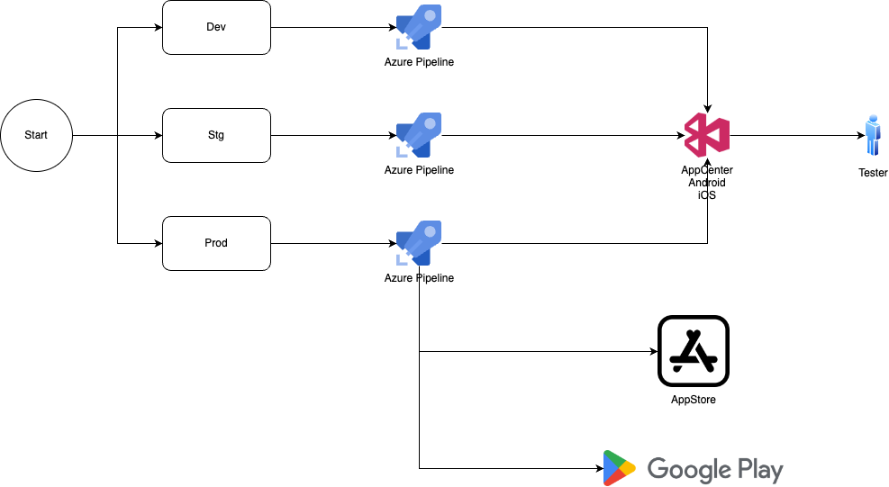

1.  Kullanılan branch mimarisi aşağıdaki gibidir. Dev pipeline trigger yardımı ile otomatik tetiklenir. Diğer pipelinelar arayüzden manuel tetiklenmesi gerekir.
    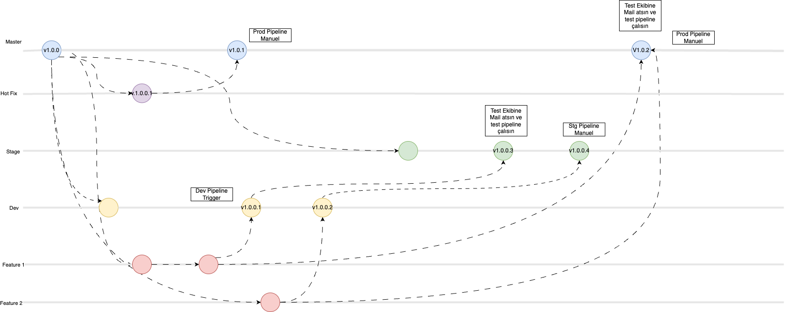
